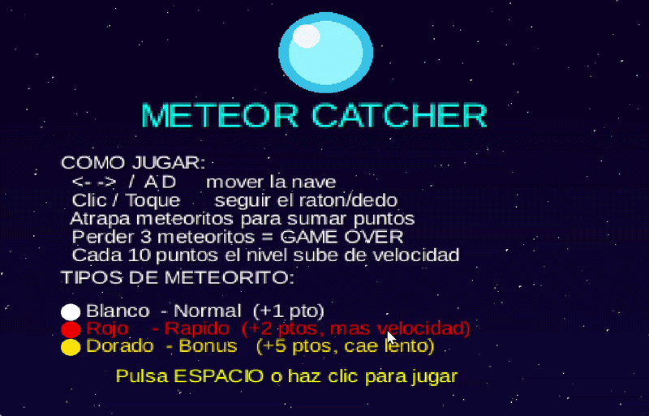

# Meteor Catcher



## Introducción

**Nombre del juego:** Meteor Catcher

**Temática:** El jugador pilota una nave espacial tipo OVNI que debe moverse horizontalmente cerca del suelo para interceptar meteoritos que caen del espacio profundo. El universo del juego transcurre en un fondo estrellado generado de forma procedural.

**Personajes y elementos principales:**
- **Nave del jugador (UFO):** Controlada horizontalmente mediante teclado (`← → / A D`) o ratón/toque. Se sitúa en la parte inferior de la pantalla.
- **Meteoritos:** Objetos que caen en posiciones horizontales aleatorias desde la parte superior. Existen tres tipos con diferentes velocidades, valores de puntuación y colores.

**Objetivo:** Atrapar el mayor número de meteoritos posible antes de perder las 3 vidas disponibles. Cada meteorito que escapa por la parte inferior resta una vida. Al llegar a 0 vidas aparece la pantalla de Game Over.

---

## Desarrollo

### Lógica del juego

#### Movimiento y Delta Time

Todo desplazamiento multiplica la velocidad (px/s) por el parámetro `delta` que libGDX proporciona en cada llamada a `render(float delta)`:

```
posición ±= velocidad × delta
```

Esto garantiza que la velocidad percibida sea idéntica en cualquier hardware, independientemente de la frecuencia de actualización (30, 60 o 120 FPS).

#### Sistema de colisiones (AABB)

La detección de colisiones usa rectángulos alineados con los ejes (*Axis-Aligned Bounding Box*). Cada meteorito y la nave tienen asignado un `Rectangle` de libGDX. En cada fotograma se evalúa:

```java
if (drop.rect.overlaps(bucket)) { /* meteorito atrapado */ }
```

El método `Rectangle.overlaps()` es O(1) y suficiente para este estilo de juego 2D con pocos objetos simultáneos.

#### Generación aleatoria de meteoritos

Los meteoritos se generan cada `spawnInterval` segundos en una posición horizontal aleatoria con `MathUtils.random()`. El tipo también se elige aleatoriamente:

| Tipo   | Prob. | Velocidad | Puntos | Color  |
|--------|-------|-----------|--------|--------|
| Normal | 70 %  | ×1.0      | +1     | Blanco |
| Rápido | 20 %  | ×1.8      | +2     | Rojo   |
| Bonus  | 10 %  | ×0.6      | +5     | Dorado |

El color se aplica mediante `SpriteBatch.setColor()`, que tiñe la textura base (círculo blanco) con el color exacto del tipo gracias a la multiplicación de color de OpenGL.

#### Dificultad progresiva

Cada 10 puntos el nivel sube automáticamente:
- La **velocidad base** de caída aumenta +30 px/s por nivel.
- El **intervalo de spawn** disminuye −0.08 s por nivel (mínimo: 0.35 s).

---

### Estructura del juego

El proyecto sigue la arquitectura de **pantallas** de libGDX. `Main` extiende `Game` y actúa como controlador central que gestiona los cambios de pantalla:

```
Main (Game)
 ├── MenuScreen   ← pantalla inicial con instrucciones y leyenda
 └── GameScreen   ← partida activa
      ├── [R]  → reinicio de partida
      └── [M]  → volver a MenuScreen
```

#### Clases

| Clase | Responsabilidad |
|-------|----------------|
| `Main` | Punto de entrada. Crea el `SpriteBatch` compartido e inicia `MenuScreen`. |
| `MenuScreen` | Título, instrucciones de control y leyenda de tipos de meteorito. Arranca `GameScreen` con ESPACIO o clic. |
| `GameScreen` | Toda la lógica activa: input, movimiento, colisiones AABB, spawn, dificultad progresiva, HUD y Game Over. Contiene la clase interna `Drop` y el enum `DropType`. |
| `PixmapFactory` | Utilidad estática que genera todas las texturas del juego de forma procedural mediante `Pixmap`, sin archivos de imagen externos. |

#### Gestión de recursos

- El `SpriteBatch` se instancia **una sola vez** en `Main` y se comparte entre pantallas.
- Cada `Screen` carga sus assets en `show()` y los libera en `hide() → dispose()`.
- Los `Pixmap` se crean, se convierten en `Texture` y se **descartan inmediatamente** para no retener memoria nativa.
- `Sound` se usa para efectos cortos (impacto); `Music` se usa en bucle para el ambiente.

---

## Conclusiones

### Separación entre representación lógica y gráfica

La lección más importante del desarrollo con libGDX es que la **posición lógica** (el `Rectangle`) y la **representación visual** (la `Texture` dibujada por `SpriteBatch`) son capas completamente independientes. El `Rectangle` gestiona posición, tamaño y colisiones; `SpriteBatch.draw()` solo pinta el sprite en las coordenadas que ese `Rectangle` indica. El motor de física no sabe nada de gráficos, y los gráficos no saben nada de física. Esto permite cambiar sprites sin tocar la lógica y viceversa.

### Importancia del Delta Time

Sin aplicar `delta`, el juego correría más rápido en hardware potente y más lento en hardware débil, haciendo la experiencia inconsistente e injusta. Con delta time, el movimiento se expresa en *píxeles por segundo* y es independiente del FPS.

### Generación procedural de texturas

Construir texturas con `Pixmap` en tiempo de ejecución elimina la dependencia de archivos de imagen para formas geométricas simples. La ventaja es la portabilidad y el control total sobre el visual desde el código; la desventaja es que las formas están limitadas a primitivas básicas. Para arte detallado, lo correcto es usar spritesheets cargadas desde disco.

### Arquitectura de pantallas

La interfaz `Screen` impone un ciclo de vida claro (`show → render → hide → dispose`) que facilita la gestión de recursos y evita fugas de memoria al cambiar de pantalla. Separar la lógica de menú y de juego en clases distintas hace el código mantenible y extensible sin acoplamiento.

## Platforms

- `core`: Main module with the application logic shared by all platforms.
- `lwjgl3`: Primary desktop platform using LWJGL3; was called 'desktop' in older docs.

## Gradle

This project uses [Gradle](https://gradle.org/) to manage dependencies.
The Gradle wrapper was included, so you can run Gradle tasks using `gradlew.bat` or `./gradlew` commands.
Useful Gradle tasks and flags:

- `--continue`: when using this flag, errors will not stop the tasks from running.
- `--daemon`: thanks to this flag, Gradle daemon will be used to run chosen tasks.
- `--offline`: when using this flag, cached dependency archives will be used.
- `--refresh-dependencies`: this flag forces validation of all dependencies. Useful for snapshot versions.
- `build`: builds sources and archives of every project.
- `cleanEclipse`: removes Eclipse project data.
- `cleanIdea`: removes IntelliJ project data.
- `clean`: removes `build` folders, which store compiled classes and built archives.
- `eclipse`: generates Eclipse project data.
- `idea`: generates IntelliJ project data.
- `lwjgl3:jar`: builds application's runnable jar, which can be found at `lwjgl3/build/libs`.
- `lwjgl3:run`: starts the application.
- `test`: runs unit tests (if any).

Note that most tasks that are not specific to a single project can be run with `name:` prefix, where the `name` should be replaced with the ID of a specific project.
For example, `core:clean` removes `build` folder only from the `core` project.
